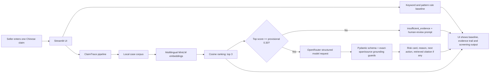

# ClaimTrace product documentation

## Product and intended persona

ClaimTrace is a prototype for small Chinese e-commerce sellers who want a first-pass warning while preparing product-page copy. “Small seller without dedicated compliance support” is a design persona, not a conclusion from seller interviews. The project author has prior product-copy editing experience using a prohibited-words list followed by supervisor review; the recalled 1–3 minutes per item was not timed and is not a measured benefit.

The product supports review, not approval. It does not issue legal, medical or financial advice, block every out-of-scope claim, or assign a real human reviewer. `low_risk` only means the configured prototype checks did not identify a concern within their limited scope.

## Input and output

**Input:** one Chinese product-advertising claim entered in the Streamlit interface. When retrieval reaches the provisional 0.30 cosine-similarity threshold, the claim and retrieved case text are sent to the configured OpenRouter model. A claim below the threshold returns `insufficient_evidence` without a model call. Do not submit secrets, personal data or confidential commercial text.

**Outputs in the current response schema:**

- `risk_level`: `high_risk`, `evidence_needed`, `low_risk` or `insufficient_evidence`;
- `highlighted_claim`: shown only if the returned text is an exact contiguous substring of the submitted claim; otherwise suppressed;
- `reason` and `next_action`: model-generated English text, not an independently verified legal conclusion;
- `source_title` and `source_url`: shown only when the title-and-URL pair exactly matches one of the retrieved records;
- `confidence` and `abstain`;
- retrieved case titles, URLs and cosine similarity scores, plus the independent rule-baseline findings.

Cosine similarity is not a probability of illegality. A retrieved enforcement case describes its own parties and facts; similarity cannot establish that the current seller committed the same act. Historical `results/test_full.csv` does not store every current schema field, so these fields cannot be reconstructed for old predictions.

## High-level architecture

The architecture is a fixed pipeline, not an autonomous agent. Retrieval, abstention and the optional one-request model stage are implemented in `src/retrieval.py`, `src/risk_pipeline.py` and `src/llm_client.py`. The interface is `app.py` with reusable components in `src/ui_components.py` and bilingual text in `src/ui_text.py`. The source guard checks that a displayed title-and-URL pair came from retrieval; it does not establish that the case supports the model's reason. The model can still produce unsupported reasoning, and the span guard does not verify the risk decision.

## Targeted and reached metrics

All results below refer to saved historical outputs on the 30-item locked set, not a newly run evaluation of the current presentation or response guards. The original 80% target uses the combined positive class.

| Metric | Target / reason for tracking | Reached on saved results | Interpretation |
| --- | --- | --- | --- |
| Combined recall (`high_risk` + `evidence_needed`) | Proposal target: at least 80%; 25 reference positives | 17/25 = 68% | Not reached; abstentions count as not automatically detected. |
| `high_risk` precision and recall | Report together on the same set; 12 positives | 10/17 = 58.8% precision; 10/12 = 83.3% recall | Higher recall includes seven false-positive high-risk predictions. No separate class-specific target is documented here. |
| Three-class Macro F1 | Track balance over all three project labels | Rule baseline 40.5%; ClaimTrace 48.0% | ClaimTrace made zero `evidence_needed` predictions and had zero recall for the 13 reference examples in this class. |
| Coverage and human-review prompt rate | Show the automation/abstention trade-off | 20/30 = 66.7% coverage; 10/30 = 33.3% abstention | A prompt to seek review does not mean an actual person received a task. |
| Ten-query Chinese retrieval audit | Check retrieval on Chinese development queries | Exact expected ID 7/10; semantic relevance and risk-reminder support 10/10 | Small selected development sample, not a population accuracy estimate. |
| Citation support in human review | Check cited evidence where applicable | 10/11 = 90.9% of assessable citations among 20 reviewed items | Not applicable citations are excluded; this is not an overall system citation accuracy. |

The [evaluation guide](../evaluation/README.md), [evidence tables](EVALUATION_EVIDENCE_EN.md) and [report](BUSINESS_TECHNICAL_TRADEOFF_EN.md) document sources and denominators. The saved results predate the exact-span/source guards added to the current response path. No threshold tuning was performed on the locked set, and no result is evidence of legal compliance or generalisation to all sellers.
