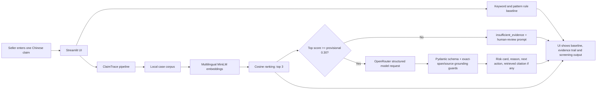

# ClaimTrace product documentation

## Product and intended persona

ClaimTrace serves small Chinese e-commerce sellers preparing product-page copy without dedicated compliance support. This design persona draws on the author's product-copy editing experience with prohibited-word lists and supervisor review. Seller interviews and timed workflow observations are planned for future validation.

A seller uses the findings and supporting records to arrange review before publication. `low_risk` means the configured checks found no concern within the project scope; a person still makes the publication decision.

## Input and output

**Input:** one Chinese product-advertising claim entered in the Streamlit interface. When retrieval reaches the provisional 0.30 cosine-similarity threshold, the claim and retrieved case text are sent to the configured OpenRouter model. A claim below the threshold returns `insufficient_evidence` without a model call. Use non-confidential inputs.

**Outputs in the current response schema:**

- `risk_level`: `high_risk`, `evidence_needed`, `low_risk` or `insufficient_evidence`;
- `highlighted_claim`: shown only if the returned text is an exact contiguous substring of the submitted claim; otherwise suppressed;
- `reason` and `next_action`: English explanations and recommendations for the reviewer;
- `source_title` and `source_url`: shown only when the title-and-URL pair exactly matches one of the retrieved records;
- `confidence` and `abstain`;
- retrieved case titles, URLs and cosine similarity scores, plus the independent rule-baseline findings.

Cosine similarity measures textual relevance. The reviewer checks the current product and seller facts against the retrieved material. Historical `results/test_full.csv` omits some current schema fields, including highlighted wording and next action.

## High-level architecture

The architecture follows a fixed sequence. Retrieval, abstention and the optional one-request model stage are implemented in `src/retrieval.py`, `src/risk_pipeline.py` and `src/llm_client.py`. The interface is `app.py` with reusable components in `src/ui_components.py` and bilingual text in `src/ui_text.py`. The guards validate the displayed span and citation against the supplied input and evidence. Factual support for the model's reasoning remains part of human review.

## Targeted and reached metrics

The following results use the saved 30-item locked evaluation, which predates the later response guards. The original 80% target uses the combined positive class.

| Metric | Target / reason for tracking | Reached on saved results | Interpretation |
| --- | --- | --- | --- |
| Combined recall (`high_risk` + `evidence_needed`) | Proposal target: at least 80%; 25 reference positives | 17/25 = 68% | Not reached; abstentions count as not automatically detected. |
| `high_risk` precision and recall | Report together on the same set; 12 positives | 10/17 = 58.8% precision; 10/12 = 83.3% recall | Seven of the 17 high-risk predictions belong to another reference class. |
| Three-class Macro F1 | Track balance over all three project labels | Rule baseline 40.5%; ClaimTrace 48.0% | ClaimTrace made zero `evidence_needed` predictions and had zero recall for the 13 reference examples in this class. |
| Coverage and human-review prompt rate | Show the automation/abstention trade-off | 20/30 = 66.7% coverage; 10/30 = 33.3% abstention | The seller arranges the requested review. |
| Ten-query Chinese retrieval audit | Check retrieval on Chinese development queries | Exact expected ID 7/10; semantic relevance and risk-reminder support 10/10 | Selected development sample of ten queries. |
| Citation support in human review | Check cited evidence where applicable | 10/11 = 90.9% of assessable citations among 20 reviewed items | Nine records have no applicable citation. |

The [evaluation guide](../evaluation/README.md), [evidence tables](EVALUATION_EVIDENCE_EN.md) and [report](BUSINESS_TECHNICAL_TRADEOFF_EN.md) document sources and denominators. The locked labels and outputs remain fixed; future model and threshold choices require development data and a new holdout.
